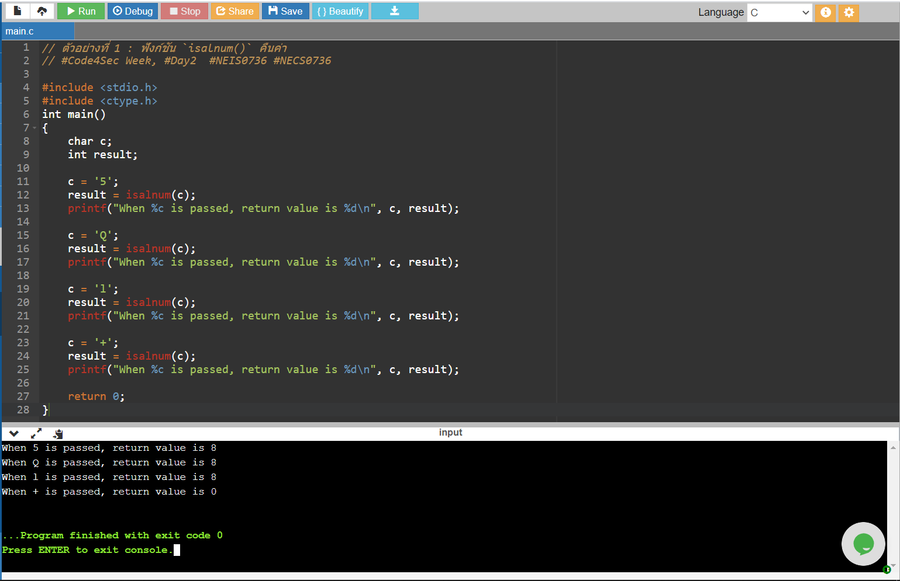
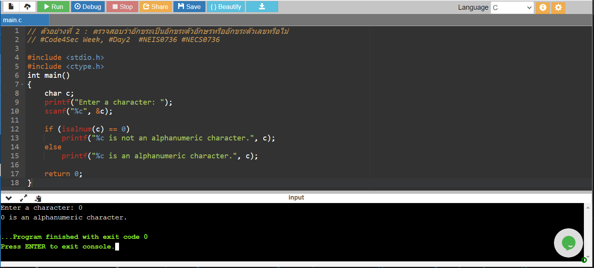

# C isalnum()

ฟังก์ชัน `isalnum()` ใช้สำหรับตรวจสอบว่าค่าอาร์กิวเมนต์ที่ถูกส่งเข้ามานั้นเป็นอักขระตัวอักษรหรืออักขระตัวเลขหรือไม่ โดยถ้าใช่จะคืนค่าเป็น 1 แต่ถ้าไม่ใช่จะคืนค่าเป็น 0 ตัวอย่างอักขระที่ไม่ใช่ตัวอักษรหรือตัวเลขก็เช่น ช่องว่าง (space) ! # % & ? และอักขระอื่นๆ ที่นอกเหนือจากตัวอักษร (A-Z, a-z หรือ อักขระ Unicode) หรือตัวเลข โดยฟังก์ชัน `isalnum()` จะเสริม security ของโปรแกรมในการตรวจสอบการป้อนข้อมูลของผู้ใช้งาน (Input Validation) ว่าอินพุตที่ถูกป้อนเข้ามานั้นเป็นรูปแบบที่ถูกกำหนดเอาไว้หรือไม่ เช่น โปรแกรมไม่ต้องการรับค่าอักขระพิเศษต่างๆ หากผู้ใช้งานหรือผู้ไม่ประสงค์ดีกรอกอักขระพิเศษเข้ามา ฟังก์ชันนี้จะสามารถตรวจสอบความถูกต้องของอินพุตให้ได้

## รูปแบบการเขียน (Syntax)
```
int isalnum(int argument);
```
ถูกกำหนดไว้ในไฟล์ส่วนหัว `ctype.h`

## Parameters
- argument -> อักขระ 1 ตัว

## การคืนค่า
- คืนค่า **1** ถ้าอาร์กิวเมนต์เป็นอักขระตัวอักษรหรืออักขระตัวเลข
- คืนค่า **0** ถ้าอาร์กิวเมนต์ไม่เป็นอักขระตัวอักษรหรืออักขระตัวเลข

## ตัวอย่างการใช้งานฟังก์ชัน `isalnum()`

### ตัวอย่างที่ 1: ฟังก์ชัน `isalnum()` คืนค่า
```
#include <stdio.h>
#include <ctype.h>
int main()
{
    char c;
    int result;

    c = '5';
    result = isalnum(c);
    printf("When %c is passed, return value is %d\n", c, result);

    c = 'Q';
    result = isalnum(c);
    printf("When %c is passed, return value is %d\n", c, result);

    c = 'l';
    result = isalnum(c);
    printf("When %c is passed, return value is %d\n", c, result);

    c = '+';
    result = isalnum(c);
    printf("When %c is passed, return value is %d\n", c, result);

    return 0;
}
```
**Output: **
```
When 5 is passed, return value is 1
When Q is passed, return value is 1
When l is passed, return value is 1
When + is passed, return value is 0
```

### ตัวอย่างที่ 2: ตรวจสอบว่าอักขระเป็นอักขระตัวอักษรหรืออักขระตัวเลขหรือไม่
```
#include <stdio.h>
#include <ctype.h>
int main()
{
    char c;
    printf("Enter a character: ");
    scanf("%c", &c);

    if (isalnum(c) == 0)
        printf("%c is not an alphanumeric character.", c);
    else
        printf("%c is an alphanumeric character.", c);
    
    return 0;
}
```
**Output: **
```
Enter a character: 0
0 is an alphanumeric character.
```

## ทดสอบรันบน onlinegdb.com




## Reference
- [https://www.programiz.com/c-programming/library-function/ctype.h/isalnum](https://www.programiz.com/c-programming/library-function/ctype.h/isalnum)
