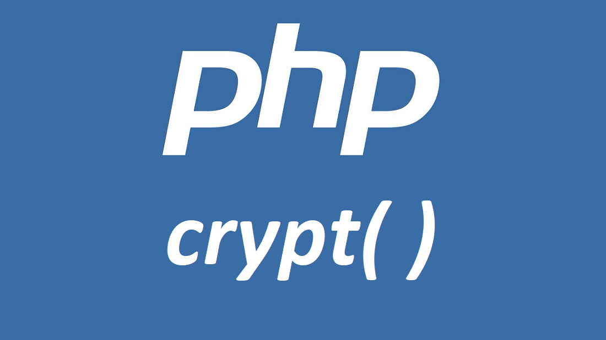

# PHP crypt()

ฟังก์ชัน `crypt()` คือ One-way string hashing เป็นการแฮชสตริงแบบทิศทางเดียว โดยการ hash ข้อมูล คือ การเปลี่ยนข้อมูลต่างๆ ข้อมูลอะไรก็ได้ที่อยู่บนโลกของ digital ให้อยู่ในรูปของ bit ที่มีขนาดแน่นอนตายตัว ส่วนคำว่า One-way หมายความว่าไม่สามารถ de-hash ข้อมูลเดิมกลับมาได้ มีทางเดียวคือจะต้อง brute-force output ไปเรื่อยๆจนกว่าจะได้ค่าที่เท่ากับค่า hashing output เดิม

## รูปแบบการเขียน (Syntax)
```
crypt ( string $string , string $salt ) : string
```

## Parameters
- $string -> สตริงที่จะถูกแฮช
- $salt -> ซอลส์สตริงเพื่อใช้เป็นฐานการแฮช(สามารถไม่ใส่ได้) หากไม่ได้ระบุไว้พฤติกรรมจะถูกกำหนดโดยการใช้อัลกอริทึมและอาจนำไปสู่ผลลัพธ์ที่ไม่คาดคิด

## การคืนค่า
ส่งคืนสตริงซึ่งถูกแฮชหรือสตริงซึ่งที่สั้นกว่า 13 ตัวอักษร และถูกรับประกันว่าจะแตกต่างจากซอลส์เมื่อล้มเหลว

## ตัวอย่างการใช้งานฟังก์ชัน `crypt()`
### ตัวอย่างที่ 1: การใช้ crypt() กับประเภทการแฮชต่างๆ
```
<?php
/* These salts are examples only, and should not be used verbatim in your code.
   You should generate a distinct, correctly-formatted salt for each password.
*/
echo 'Standard DES: ',
    crypt('Anan Boondamnoen', 'Anan Boondamnoen'),
    "\n";
echo 'Extended DES: ',
    crypt('Anan Boondamnoen', '6317810009'),
    "\n";
echo 'MD5:          ',
    crypt('Anan Boondamnoen', '#Code4Sec Week'),
    "\n";
echo 'Blowfish:     ',
    crypt('Anan Boondamnoen', '#Day5'),
    "\n";
echo 'SHA-256:      ',
    crypt('Anan Boondamnoen', '#NEIS0736'),
    "\n";
echo 'SHA-512:      ',
    crypt('Anan Boondamnoen', '#NECS0736'),
    "\n";
?>
```
**Output: **
```
Standard DES: AnefFttCiyZwU                                                                                                                     
Extended DES: 63Eo7PkDEfKm.                                                                                                                     
MD5:          #CW2H2/NAk0XM                                                                                                                     
Blowfish:     #Da82WXSDj8dY                                                                                                                     
SHA-256:      #NBgLEei7XKiw                                                                                                                     
SHA-512:      #NBgLEei7XKiw
```

## Reference
- [https://www.php.net/manual/en/function.crypt.php](https://www.php.net/manual/en/function.crypt.php)
- [https://medium.com/dcen/hashing-algorithm-in-blockchain-367f09e043cf](https://medium.com/dcen/hashing-algorithm-in-blockchain-367f09e043cf)