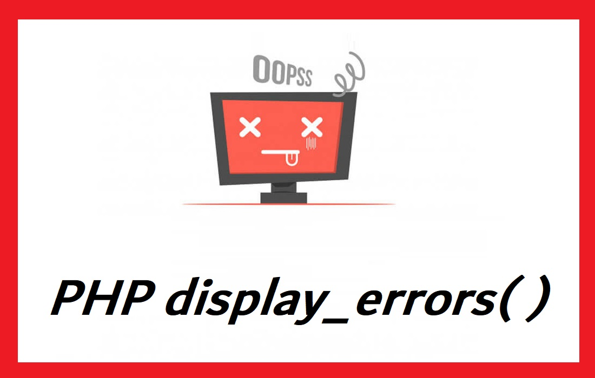

# PHP display_errors()

การตรวจสอบข้อผิดพลาด (error) เวลาพัฒนาโปรแกรมหรือเมื่อรันโปรแกรม ถือว่ามีความสำคัญอย่างหนึ่ง เพื่อที่จะทำให้ระบบทำงานได้อย่างถูกต้อง สำหรับการพัฒนา Web Application ด้วย PHP วิธีหนึ่งในการตรวจสอบหรือแสดงผลข้อผิดพลาด คือการแสดงข้อผิดพลาด (error) ผ่านหน้าเว็บ โดยการแสดงผลข้อผิดพลาดผ่านหน้าเว็บเมื่อรันโปรแกรมเลย ถือว่ามีความสะดวกสบายมาก คือเมื่อโปรแกรมเมอร์พัฒนาโปรแกรมไปรันผ่านหน้าเว็บ ก็สามารถเห็นข้อผิดพลาดที่เกิดขึ้นได้เลยว่าเกิดปัญหาที่ไหน ไฟล์อะไร บรรทัดเท่าไร แต่จะมีข้อเสียอย่างมาก หากปล่อยให้มีการแสดงผลข้อผิดพลาดนี้แก่ผู้ใช้งานทั่วไป เพราะอาจแสดงรายละเอียดโปรแกรมมากเกินไป ซึ่งอาจทำให้เปิดเผยช่องโหว่ของโปรแกรมได้ คำแนะนำคือในขณะที่กำลังพัฒนาโปรแกรม (development) หรือบนเครื่องเซิร์ฟเวอร์สำหรับทดสอบโปรแกรม เราอาจเปิดการแสดงผลข้อผิดพลาดผ่านหน้าเว็บเลย เพื่อสะดวกต่อโปรแกรมเมอร์ในการตรวจสอบ แต่เมื่อไรก็ตามระบบเริ่มใช้งานจริง (production) แนะนำให้ปิดการแสดงผลข้อผิดพลาดผ่านหน้าเว็บ ให้เก็บข้อผิดพลาดไว้ในไฟล์ (log file) แล้วดูข้อผิดพลาดจากในไฟล์

## ตัวอย่างข้อผิดพลาดในการเขียน PHP เช่น พิมพ์เครื่องหมาย `:` แทนที่เป็น `;`
```
$ cat /var/www/html/test.php
<?php
print 'hello':
?>
```

## แสดงข้อผิดพลาดผ่านหน้าเว็บ (DISPLAY_ERRORS)
PHP เวอร์ชั่นหลังๆจะปิดการแสดงข้อผิดพลาดผ่านหน้าเว็บ หากต้องการเปิดคุณสมบัตินี้ทำได้สองวิธีคือ
1. แก้ไฟล์ /etc/php.ini จะมีผลทั้งเซิร์ฟเวอร์
ออปชั่นที่ต้องแก้ไขคือ “display_errors”
    - “On” หากต้องการเปิดการแสดงผลข้อผิดพลาดผ่านหน้าเว็บ เหมาะสำหรับการพัฒนาโปรแกรม (development)
    - “Off” หากไม่ต้องการแสดงผลข้อผิดพลาดผ่านหน้าเว็บ สำหรับระบบที่ใช้งานจริงแล้ว (production)

**ตัวอย่างการคอนฟิกในไฟล์ /etc/php.ini**
```
display_errors = On
```
หลังจากแก้ไขไฟล์ ต้องรีโหลด Web Server เพื่อให้คอนฟิกใหม่มีผล


**ตัวอย่างการแสดงผลข้อผิดพลาดผ่านหน้าเว็บ**


2. หากไม่สามารถแก้ไขไฟล์ /etc/php.ini ได้ สามารถใช้ฟังก์ชั่น “ini_set” เพื่อเปิดคุณสมบัตินี้ได้
**ตัวอย่างการใช้ฟังก์ชั่น “ini_set” เพื่อตั้งค่าคอนฟิก “display_errors”**

```
<?php
ini_set('display_errors', TRUE);
...
?>
```

## Reference
- [https://spalinux.com/2010/02/configure_display_php_errors](https://spalinux.com/2010/02/configure_display_php_errors)