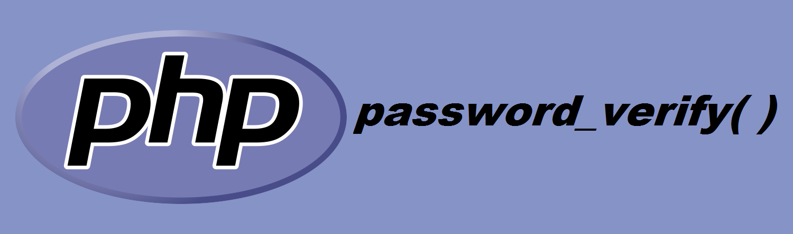

# PHP password_verify()

ฟังก์ชัน `password_verify()` ใช้ในการตรวจสอบว่ารหัสผ่านตรงกับค่าแฮชหรือไม่

## รูปแบบการเขียน (Syntax)
```
password_verify ( string $password , string $hash ) : bool
```
โปรดสังเกตว่าฟังก์ชัน password_hash() นั้นส่งคืน algorithm, cost และ salt ในฐานะที่เป็นส่วนของแฮชซึ่งถูกส่งคืน ดังนั้นข้อมูลทั้งหมดซึ่งจำเป็นเพื่อการตรวจสอบแฮชจะถูกรวมอยู่ภายในนั้น สิ่งนี้อนุญาตให้ฟังก์ชั่นตรวจสอบยืนยันแฮชโดยไม่จำเป็นต้องมีพื้นที่จัดเก็บแยกต่างหากสำหรับข้อมูล salt หรือ algorithm
ฟังก์ชันนี้ปลอดภัยต่อการโจมตีแบบ timing attacks

## Parameters
- $password -> รหัสผ่านของผู้ใช้งาน
- $hash -> แฮชซึ่งถูกสร้างโดยฟังก์ชัน password_hash()

## การคืนค่า
- คืนค่า **true** ถ้ารหัสผ่านและแฮชตรงกัน
- คืนค่า **false** ถ้ารหัสผ่านและแฮชไม่ตรงกัน

## ตัวอย่างการใช้งานฟังก์ชัน `password_verify()`
### ตัวอย่างที่ 1:
```
<?php
// See the password_hash() example to see where this came from.
$hash = '$2y$07$BCryptRequires22Chrcte/VlQH0piJtjXl.0t1XkA8pw9dMXTpOq';

if (password_verify('rasmuslerdorf', $hash)) {
    echo 'Password is valid!';
} else {
    echo 'Invalid password.';
}
?>
```
**Output: **
```
Password is valid!
```

## Reference
- [https://www.php.net/manual/en/function.password-verify.php](https://www.php.net/manual/en/function.password-verify.php)
