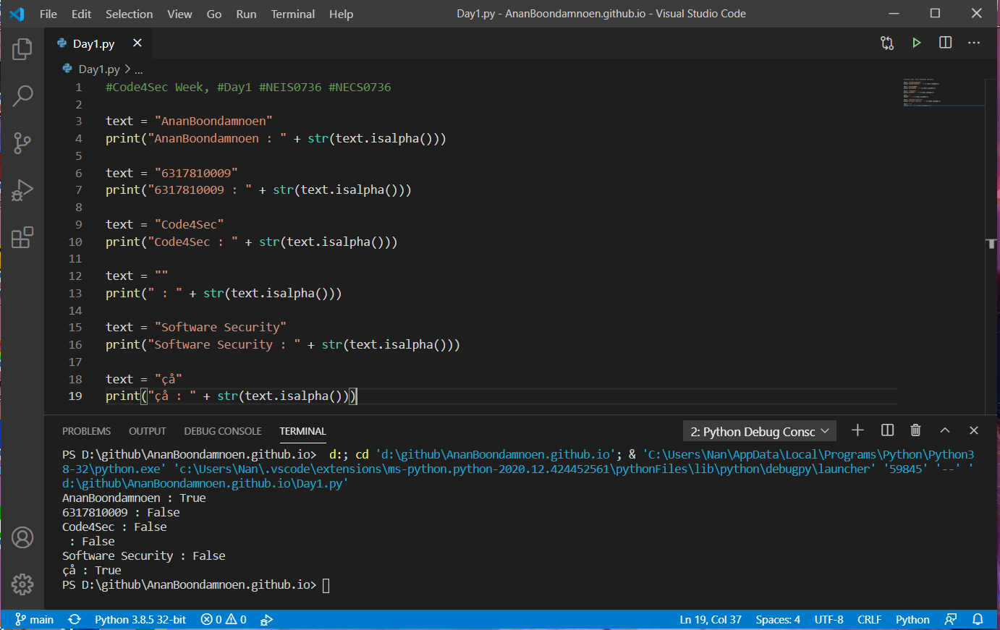

# Python String isalpha()

เมธอด `isalpha()` เป็นเมธอดของสตริง ใช้สำหรับตรวจสอบว่าอักขระในสตริงเป็นตัวอักษร (a-z) ทั้งหมดหรือไม่ โดยถ้าใช่จะคืนค่าเป็น True แต่ถ้าไม่ใช่จะคืนค่าเป็น False ตัวอย่างอักขระที่ไม่ใช่ตัวอักษรก็เช่น ช่องว่าง (space) ! # % & ? และอักขระอื่นๆ ที่นอกเหนือจากตัวอักษร (a-z) โดยเมธอด `isalpha()` จะเพิ่ม Security ของโปรแกรมในการตรวจสอบการป้อนข้อมูลของผู้ใช้งาน (Input Validation) ว่าอินพุตที่ถูกป้อนเข้ามานั้นเป็นรูปแบบที่ถูกกำหนดเอาไว้หรือไม่ เช่น โปรแกรมต้องการรับค่าชื่อผู้ใช้งานซึ่งเป็นภาษาอังกฤษเท่านั้น หากผู้ใช้งานหรือผู้ไม่ประสงค์ดีกรอกตัวเลขหรืออักขระพิเศษเข้ามา เมธอดนี้จะสามารถตรวจสอบความถูกต้องของอินพุตให้ได้

## รูปแบบการใช้งาน
เมธอด `isalpha()` ไม่มีพารามิเตอร์ โดยมีรูปแบบการใช้งาน ดังนี้
```
string.isalpha()
```

## ตัวอย่างการใช้งานเมธอด `isalpha()`

### ตัวอย่างที่ 1 : อักขระทั้งหมดในสตริงเป็นตัวอักษร
```
text = "AnanBoondamnoen"
print(text.isalpha())
```
**Output: `True`**

### ตัวอย่างที่ 2 : อักขระทั้งหมดในสตริงเป็นตัวเลข
```
text = "6317810009"
print(text.isalpha())
```
**Output: `False`**

### ตัวอย่างที่ 3 : อักขระในสตริงเป็นตัวอักษรผสมตัวเลข
```
text = "Code4Sec"
print(text.isalpha())
```
**Output: `False`**

### ตัวอย่างที่ 4 : อักขระในสตริงเป็นสตริงว่าง
```
text = ""
print(text.isalpha())
```
**Output: `False`**

### ตัวอย่างที่ 5 : อักขระในสตริงมีอักขระช่องว่าง (space)
```
text = "Software Security"
print(text.isalpha())
```
**Output: `False`**

### ตัวอย่างที่ 6 : อักขระในสตริงเป็นอักขระ Unicode
```
text = "çå"
print(text.isalpha())
```
**Output: `True`**

## ทดสอบรันด้วยโปรแกรม Visual Studio Code
<!--  -->


## References
- [https://www.dcrub.com/python-string-isalpha-method](https://www.dcrub.com/python-string-isalpha-method)
- [https://www.journaldev.com/24026/python-string-isalpha#python-string-isalpha](https://www.journaldev.com/24026/python-string-isalpha#python-string-isalpha)
- [https://wtmatter.com/python-string-isalpha](https://wtmatter.com/python-string-isalpha/)